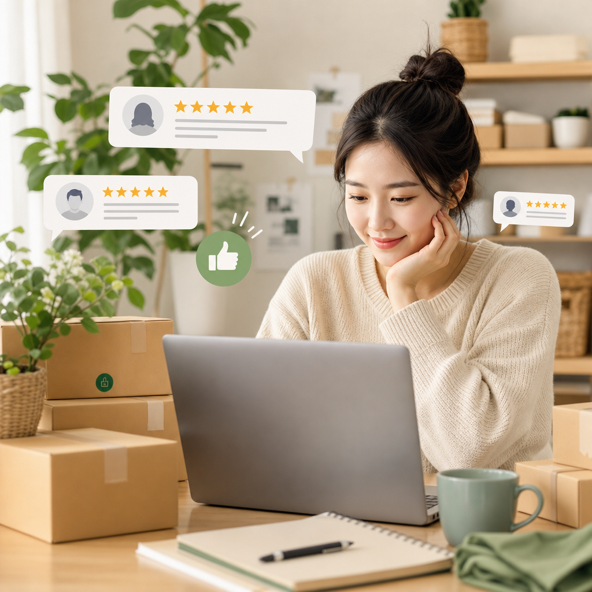
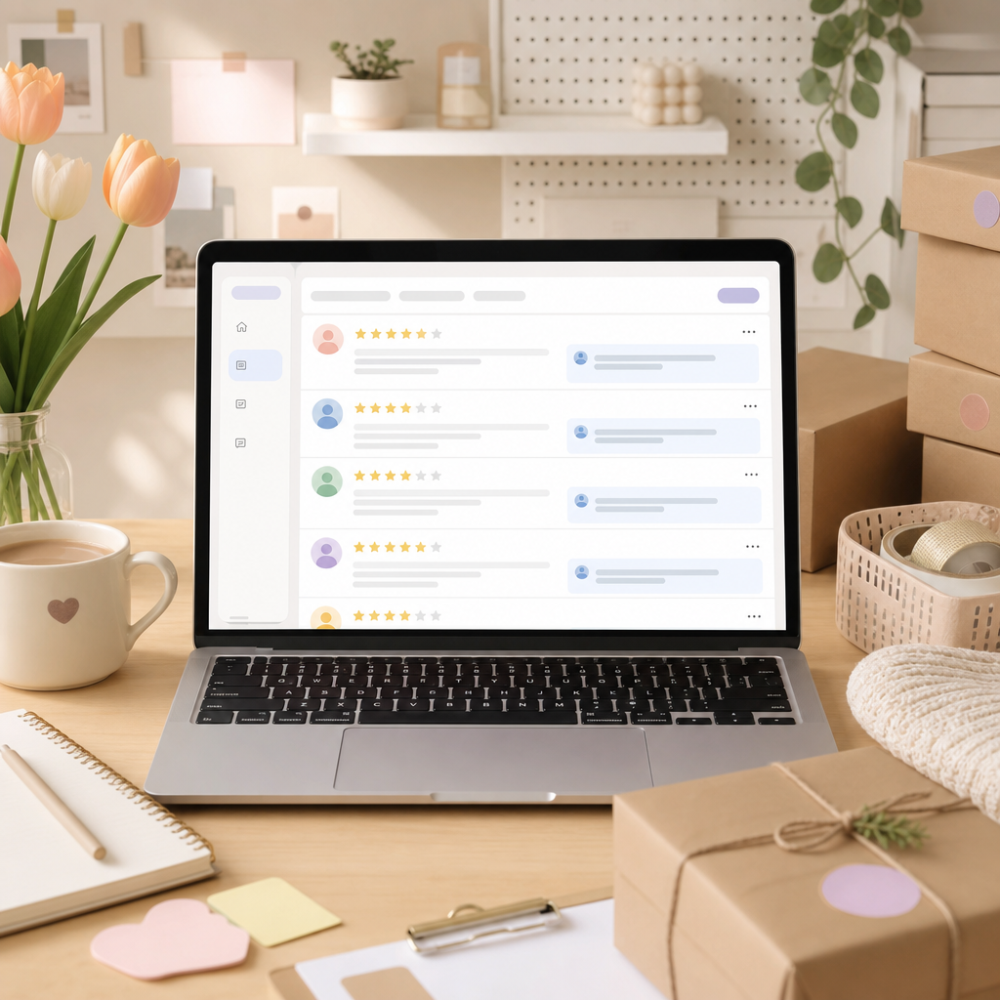
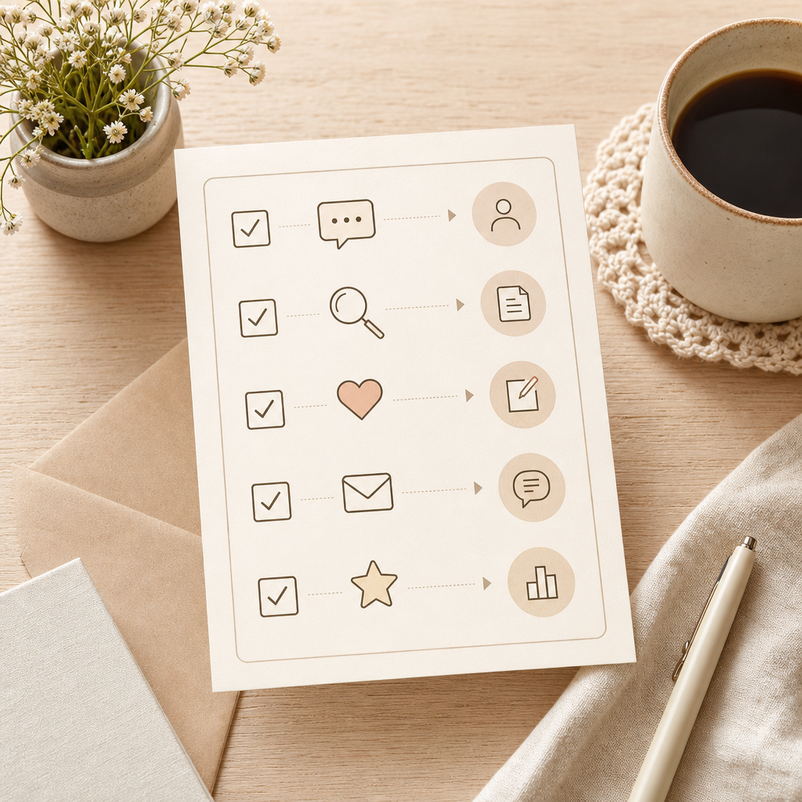

# 스마트스토어 리뷰 답변, 복붙처럼 보이지 않게 쓰는 법

- 작성일: 2026-05-15
- 활용 데이터: 폐기 일감 `스마트스토어 리뷰 답변·재구매 유도 키트 KR`
- 목적: 유료 상품으로 바로 팔기엔 차별성이 약했던 자료를 무료 블로그 검증용 콘텐츠로 전환
- 추천 카테고리: 스마트스토어 운영 / 온라인몰 운영 / 1인 셀러 노트
- 태그: 스마트스토어, 리뷰답변, 리뷰관리, 온라인몰운영, 재구매, 고객응대, 1인셀러
- 메타 설명: 스마트스토어 리뷰 답변을 매번 새로 쓰기 어려운 1인 셀러를 위해 별점별 답변 예시와 낮은 별점 대응 순서를 정리했습니다.

스마트스토어를 하다 보면 생각보다 자주 막히는 게 리뷰 답변입니다.

상품 등록이나 광고 세팅처럼 거창한 일은 아닌데, 막상 쓰려면 손이 멈춥니다. 5점 리뷰에는 감사하다고 하면 될 것 같은데 너무 성의 없어 보일까 걱정되고, 3점 이하 리뷰는 괜히 한 문장 잘못 썼다가 더 커질까 조심스럽습니다.

저도 이 자료를 처음에는 “리뷰 답변 템플릿 묶음”으로 만들면 팔 수 있지 않을까 생각했는데요.

결론부터 말하면, 그냥 템플릿만 모아둔 건 유료 상품으로는 약했습니다. 요즘은 AI로 문구를 금방 만들 수 있으니까요.

그래도 버리긴 아까웠습니다.

실제로 1인 셀러 입장에서는 리뷰 답변을 매번 새로 쓰는 일이 꽤 피곤하고, 낮은 별점 리뷰 앞에서 감정이 먼저 올라오는 것도 현실이거든요.

그래서 이번 글은 판매용 자료가 아니라, 바로 써볼 수 있는 무료 정리 글로 남겨봅니다.

## 리뷰 답변은 예쁘게 쓰는 글이 아닙니다

리뷰 답변을 너무 홍보 문구처럼 쓰면 오히려 어색합니다.

구매자는 사장님의 문장력을 보려고 리뷰창을 보는 게 아니라, 이 스토어가 문제 생겼을 때 어떻게 대응하는지 봅니다.

특히 낮은 별점 리뷰 밑에 달린 답변은 새 고객도 봅니다.

“아, 여기는 불만이 생겨도 최소한 확인은 해주는구나.”

이 정도 신뢰만 줘도 충분할 때가 많습니다.

## 5점 리뷰 답변은 길게 쓸 필요 없습니다

좋은 리뷰에 답할 때는 너무 과하게 감동한 문장보다, 짧고 안정적인 문장이 낫습니다.

예를 들면 이렇게요.

> 소중한 후기 감사합니다. 상품이 만족스러우셨다니 정말 기쁩니다. 더 좋은 상품과 빠른 응대로 보답하겠습니다.

> 사진 후기까지 남겨주셔서 감사합니다. 실제 사용 후기가 다른 고객님께도 큰 도움이 됩니다.

> 믿고 구매해 주셔서 감사합니다. 사용 중 궁금한 점이 생기면 언제든 문의 주세요.

여기서 중요한 건 “감사합니다”만 반복하지 않는 겁니다.

사진 후기인지, 재구매 후기인지, 배송 칭찬인지에 따라 한 문장만 바꿔도 복붙 느낌이 많이 줄어듭니다.

## 4점 리뷰는 방어하지 않는 게 먼저입니다

4점 리뷰가 은근 어렵습니다.

완전히 불만은 아닌데, 뭔가 아쉬웠다는 뜻이 들어있을 때가 많습니다. 이때 “그래도 만족하셨다니 감사합니다”로만 넘기면 조금 무심해 보일 수 있습니다.

이럴 때는 아쉬움을 먼저 받아주는 게 낫습니다.

> 후기 감사합니다. 전반적으로 만족하셨지만 아쉬운 부분도 있었던 것 같습니다. 남겨주신 의견은 다음 개선에 반영하겠습니다.

> 좋은 점과 아쉬운 점을 함께 남겨주셔서 감사합니다. 말씀 주신 부분은 포장과 검수 과정에서 다시 확인해 보겠습니다.

> 옵션별 차이를 더 쉽게 확인하실 수 있도록 상세페이지 안내도 보완하겠습니다.

말이 쉽지요.

막상 사장님 입장에서는 “상세페이지에 적어뒀는데…” 싶은 마음이 먼저 들 수 있습니다. 그래도 공개 답변에서는 설명보다 태도가 먼저 보입니다.

## 낮은 별점 리뷰는 답변보다 순서가 중요합니다

낮은 별점 리뷰를 받으면 바로 답글부터 달고 싶어집니다.

그런데 이때 가장 위험한 게 감정이 섞인 첫 문장입니다.

하지 않는 게 좋은 표현은 이런 쪽입니다.

- “다른 고객님들은 문제없이 사용합니다.”
- “상세페이지에 다 적혀 있습니다.”
- “택배사 문제라 저희 책임이 아닙니다.”
- “리뷰 내려주시면 처리해 드립니다.”
- “악의적인 리뷰입니다.”

다 맞는 말처럼 느껴질 때도 있지만, 보는 사람 입장에서는 방어적으로 보일 수 있습니다.

낮은 별점 리뷰에는 아래 순서가 안전합니다.

1. 불편 인정
2. 정확한 확인을 위한 문의 채널 안내
3. 같은 문제를 줄이겠다는 점검 의지
4. 해결 후 공개 답변 업데이트

예시 문장은 이 정도면 충분합니다.

> 불편을 드려 죄송합니다. 남겨주신 내용은 확인했으며, 정확한 상황 확인 후 안내드릴 수 있도록 문의 채널로 연락 부탁드립니다. 동일한 불편이 반복되지 않도록 내부에서 점검하겠습니다.

해결이 끝난 뒤에는 이렇게 정리할 수 있습니다.

> 문의 주신 내용은 확인 후 안내드렸습니다. 불편을 겪으신 점 다시 한번 죄송합니다. 남겨주신 의견은 검수와 상세 안내 개선에 반영하겠습니다.

여기서도 개인정보는 절대 쓰지 않는 게 좋습니다.

주문번호, 주소, 연락처, 고객의 자세한 상황은 공개 리뷰 답변에 남기지 않는 쪽이 안전합니다.

## 재구매 메시지는 “팔기”보다 “불편 없는지 확인”부터

재구매 유도 메시지도 조심해야 합니다.

너무 빨리 쿠폰부터 보내면 광고처럼 느껴지고, 너무 자주 보내면 부담스럽습니다.

개인적으로는 이 순서가 가장 자연스럽습니다.

1. 배송 완료 후 불편 확인
2. 사용 팁 제공
3. 필요한 시점에 재구매 안내
4. 쿠폰은 선택 사항으로 안내

예시로는 이런 식입니다.

> 주문하신 상품은 잘 받아보셨을까요? 사용 중 궁금한 점이나 불편한 부분이 있으시면 언제든 문의 주세요.

> 오래 사용하시려면 보관 방법을 한 번 확인해 주세요. 궁금한 점은 편하게 문의 주세요.

> 꾸준히 사용하시는 상품이라면 보통 3~4주 후 재구매하시는 고객님이 많습니다. 필요하실 때 참고해 주세요.

> 재구매 고객님께 사용할 수 있는 쿠폰이 있습니다. 무리한 구매보다 필요하실 때만 활용해 주세요.

이 마지막 문장이 의외로 중요합니다.

“지금 사세요”보다 “필요할 때 쓰세요”가 작은 스토어에는 더 자연스러울 때가 많습니다.

## 하루 10분만 기록해도 답변이 달라집니다

리뷰 답변을 잘 쓰려면 템플릿도 필요하지만, 기록이 더 중요합니다.

어떤 상품에서 낮은 별점이 반복되는지, 어떤 옵션에서 사이즈 불만이 나오는지, 어떤 배송 이슈가 자주 생기는지 적어두면 답변도 달라지고 상세페이지도 달라집니다.

리뷰 하나마다 아래만 남겨도 충분합니다.

- 날짜
- 상품명 / 옵션
- 별점
- 불만 분류
- 실제 원인
- 처리 결과
- 상세페이지 수정 필요 여부
- 포장/검수 수정 필요 여부
- 다음 액션

처음부터 거창한 CRM을 만들 필요는 없습니다.

엑셀이나 구글시트 한 장이면 됩니다.

## 바로 쓸 수 있는 상황별 문구 몇 개

### 배송이 빨랐다는 리뷰

> 빠르게 받아보셨다니 다행입니다. 앞으로도 안전한 포장과 신속한 발송을 유지하겠습니다.

### 품질이 좋다는 리뷰

> 품질을 좋게 봐주셔서 감사합니다. 오래 만족하실 수 있도록 꾸준히 관리하겠습니다.

### 가격이 괜찮다는 리뷰

> 가격 대비 만족하셨다니 다행입니다. 합리적인 가격과 안정적인 품질을 함께 지키겠습니다.

### 옵션 선택이 잘 맞았다는 리뷰

> 선택하신 옵션이 잘 맞으셨다니 기쁩니다. 자세한 후기는 다른 고객님께도 큰 도움이 됩니다.

### 아쉬움이 있는 리뷰

> 소중한 의견 감사합니다. 부족했던 부분은 내부에서 확인해 더 나은 상품으로 보완하겠습니다.

### 낮은 별점 리뷰

> 이용에 불편을 드린 점 사과드립니다. 정확한 상황 확인을 위해 문의 채널로 연락 부탁드립니다. 확인 후 가능한 범위에서 빠르게 안내드리겠습니다.

## 정답 문구보다 중요한 것

리뷰 답변에는 정답 문구가 있는 것 같지만, 사실 더 중요한 건 기준입니다.

좋은 리뷰에는 감사.

아쉬운 리뷰에는 인정.

낮은 별점에는 사과와 확인.

재구매 메시지는 판매보다 사용 경험 확인.

이 네 가지만 잡아도 답변이 훨씬 덜 흔들립니다.

그리고 한 가지 더요.

리뷰 답변을 너무 완벽하게 쓰려고 하면 계속 미루게 됩니다. 하루 10분만 정해서, 비슷한 상황은 기준 문구로 처리하고 진짜 문제가 있는 리뷰에 시간을 더 쓰는 편이 낫습니다.

제가 정리해둔 문구가 더 있는데, 반응이 있으면 업종별로 나눠서 다시 정리해보겠습니다.

예를 들면 식품, 반려동물용품, 의류처럼요.

업종마다 말투가 조금씩 달라서, 그냥 공통 템플릿보다 그쪽이 훨씬 쓸모 있을 것 같습니다.

---

## 내부용 스타일 브리프

- 대상 독자: 스마트스토어/온라인몰을 혼자 운영하는 초보 셀러
- 목소리: 직접 운영해본 사람이 조심스럽게 정리해주는 말투
- 피한 것: “필수템”, “완벽한 솔루션”, 유료 판매 강요, 과한 AI식 목차
- 활용한 폐기 이유: 유료 상품으로는 범용 템플릿/AI 대체재 위험이 커서, 무료 블로그 검증 글로 전환
- 이미지 구성: 썸네일 1장, 리뷰 답변 예시 분위기 1장, 체크리스트 카드 1장

## 샘플링 메모

검색/비교한 유사 글 패턴:

- 스마트스토어 고객 응대/후기 관리 글은 대체로 문제 상황을 먼저 열고 짧은 예시를 뒤에 붙임
- 낮은 별점 리뷰 대응 글은 “반박 금지, 사과/확인/개선” 구조가 반복됨
- 재구매 유도 글은 쿠폰보다 고객 경험/타이밍을 강조하는 편이 자연스러움
- 네이버/Tistory 글은 긴 설명보다 짧은 문단과 실제 문구 예시가 읽힘
- 강한 판매 CTA보다 “필요하면 더 정리” 식의 약한 마무리가 블로그스럽게 보임
