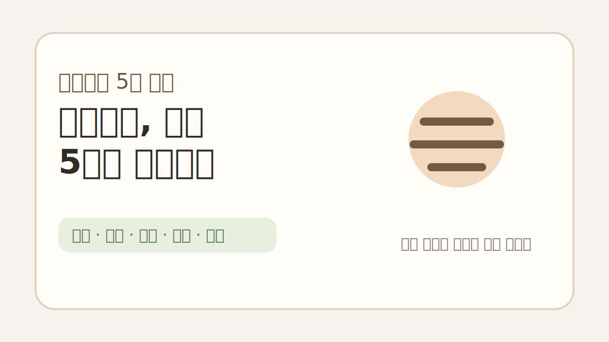
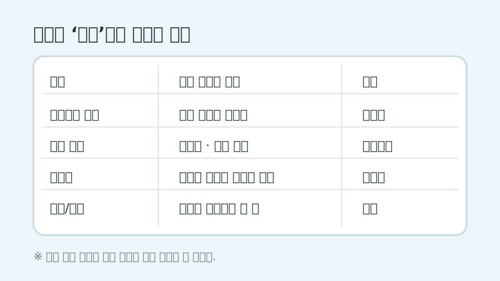
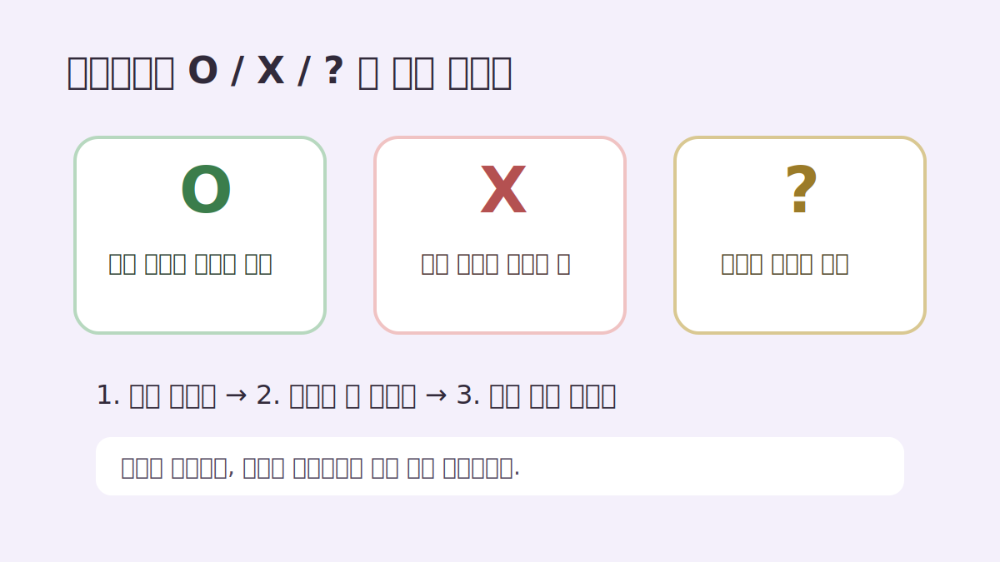

# 프리랜서 간편장부, 5월에 몰아서 정리할 때 먼저 나눠볼 것들

5월이 오면 프리랜서 분들이 제일 많이 하는 말이 있습니다.

“작년에 쓴 돈이 분명 있는데, 뭘 어디까지 적어야 할지 모르겠어요.”

이게 은근 어렵습니다. 1년 내내 장부를 써온 분보다, 카드내역과 입금내역을 5월에 한 번에 여는 분이 훨씬 많거든요.

오늘 글은 세금 신고 방법을 대신 설명하는 글이 아닙니다. 비용 인정 여부나 신고 방식은 업종, 계약 형태, 증빙 상태에 따라 달라질 수 있어서 국세청 안내나 세무 전문가 확인이 필요합니다.

대신 “엑셀을 열었을 때 어떤 칸부터 나누면 덜 막히는지”만 작게 정리해보겠습니다.

## 처음부터 완벽하게 분류하려고 하면 멈춥니다

처음부터 계정과목을 정확히 넣으려고 하면 손이 멈춥니다.

저라면 먼저 이렇게 5칸만 만듭니다.

| 날짜 | 내용 | 들어온 돈 | 나간 돈 | 메모 |
|---|---:|---:|---:|---|
| 2025-03-10 | 디자인 외주 입금 | 550,000 |  | A업체 |
| 2025-03-12 | 폰 요금 |  | 68,000 | 업무용 비율 확인 |
| 2025-03-15 | 프로그램 구독 |  | 14,900 | 작업툴 |

이 정도만 있어도 “아무것도 안 된 상태”는 벗어납니다.

그다음에 비용을 업무 관련성이 보이는 것부터 따로 표시합니다.

## 프리랜서가 자주 헷갈리는 비용 메모

예를 들면 이런 식입니다.

- 작업 프로그램 구독료: 어떤 작업에 쓰는지 메모
- 노트북/장비: 구입일, 사용 목적 메모
- 통신비: 전액인지 일부인지 나중에 확인할 수 있게 표시
- 교통비/미팅비: 누구를 만났는지 한 줄 메모
- 광고비/플랫폼 수수료: 매출과 연결되는지 표시

여기서 중요한 건 “무조건 비용 처리된다”가 아닙니다.

나중에 확인할 근거를 잃어버리지 않는 게 먼저입니다. 애매하면 애매하다고 적어두는 편이 낫습니다.

## 카드내역을 볼 때는 ‘생활비 제거’가 먼저입니다

간편장부를 정리할 때 의외로 시간을 잡아먹는 건 비용을 찾는 일이 아니라 생활비를 지우는 일입니다.

그래서 저는 먼저 이렇게 표시합니다.

- 업무 관련이 비교적 명확함: O
- 개인 지출로 보임: X
- 나중에 확인 필요: ?

처음부터 답을 내려고 하지 말고, `?`만 따로 모아도 속도가 빨라집니다.

## 입금 내역은 ‘매출 후보’로 따로 복사해두기

프리랜서 수입은 플랫폼 정산, 계좌이체, 원천징수 입금이 섞여 있을 수 있습니다.

그래서 입금 내역은 비용과 섞지 말고 한 번 따로 봅니다.

특히 같은 거래처에서 여러 번 들어온 돈은 나중에 누락되기 쉬워서, 거래처명 기준으로 한 번 정렬해보는 게 좋습니다.

말이 쉽지요. 그래도 이 과정을 해두면 신고 직전에 “이 돈 뭐였지?” 하는 시간이 줄어듭니다.

## 작은 체크리스트

마지막으로 5월에 몰아서 정리할 때는 이 정도만 확인해도 시작이 됩니다.

- [ ] 작년 계좌 입금내역 내려받기
- [ ] 카드/현금영수증 내역 내려받기
- [ ] 업무 관련 지출 O/X/? 표시하기
- [ ] 큰 금액 지출은 영수증이나 거래내역 따로 저장하기
- [ ] 애매한 항목은 국세청 안내나 세무 전문가에게 물어볼 목록으로 따로 표시하기

완벽한 신고법보다 먼저 필요한 건, 자료를 잃어버리지 않게 한곳에 모으는 일입니다.

반응이 있으면 업종별로 많이 나오는 비용 항목과 간편장부 엑셀 칸 구성도 따로 정리해볼게요.
