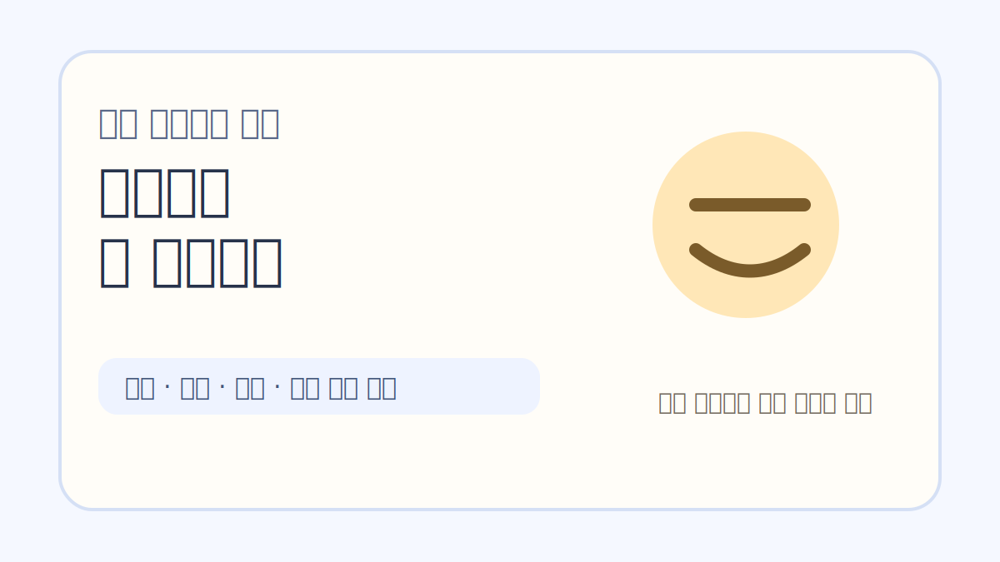
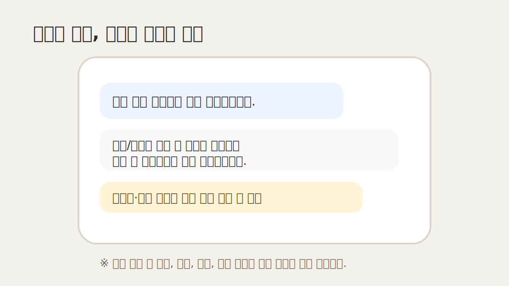
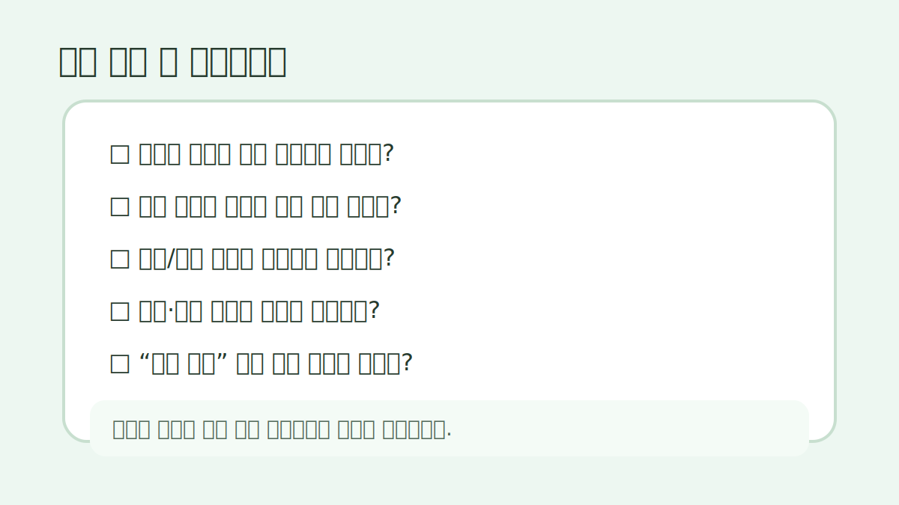

# 학원 여름방학 특강 안내문, 문자로 보낼 때 덜 어색한 예시 8개

여름방학 특강은 준비할 게 생각보다 많습니다.
시간표도 짜야 하고, 정원도 정해야 하고, 기존 원생에게 먼저 안내할지 신규 문의까지 받을지도 정해야 하니까요.

그런데 막상 문자로 보내려면 제일 애매한 게 문구입니다.
너무 광고처럼 쓰면 학부모님이 넘겨보고, 너무 짧게 쓰면 문의가 다시 들어옵니다.

아래 문구는 그대로 복사해서 쓰기보다 학원 말투와 실제 운영 기준에 맞게 조금씩 바꾸는 쪽이 좋습니다.
특히 수강료, 환불, 보강, 결석 처리 기준은 학원 내부 규정과 실제 안내문을 먼저 맞춰두셔야 합니다.

교육 성과를 보장하거나 특정 학생에게 맞는 학습 진단처럼 보이는 표현은 피했습니다. 문자 예시는 운영 안내용으로만 봐주세요.

## 먼저 정리해야 할 5가지

문자를 쓰기 전에 이것부터 정해두면 훨씬 덜 흔들립니다.

- 특강 기간: 예) 7월 22일~8월 16일
- 대상 학년: 예) 초5~중2, 중3, 고1
- 수업 목표: 예) 1학기 복습, 2학기 예습, 문법 집중
- 정원/마감 기준: 예) 반별 6명, 기존 원생 우선 안내
- 보강 기준: 예) 결석 1회 자료 제공, 개별 보강은 상황별 확인

이 다섯 가지가 빠지면 문자는 친절해 보여도 결국 다시 전화가 옵니다.

## 1. 기존 원생에게 먼저 보내는 안내

> 안녕하세요, ○○학원입니다.  
> 여름방학 기간 동안 기존 수업과 별도로 2학기 예습 특강을 운영합니다.  
> 기존 원생에게 먼저 안내드리고 있어 문자드립니다.  
> 대상/시간표 확인 후 참여를 원하시면 이번 주 금요일까지 답장 부탁드립니다.

기존 원생 안내는 “선착순 마감”보다 “먼저 안내드린다”는 느낌이 덜 부담스럽습니다.
이미 다니는 학부모님에게 너무 세게 모집 문구를 쓰면 오히려 어색하더라고요.

## 2. 신규 문의용 짧은 답변

> 문의 주셔서 감사합니다.  
> 이번 여름방학 특강은 ○학년 대상으로 진행되며, 현재 ○요일 ○시 반에 신청 가능합니다.  
> 수업은 1학기 핵심 복습과 2학기 예습 준비 중심으로 구성되어 있습니다.  
> 자세한 시간표와 수강료 안내가 필요하시면 학생 학년과 현재 학습 상황을 알려주세요.

신규 문의에는 바로 가격표만 보내기보다 학생 정보를 한 번 받는 문구가 좋습니다.
그래야 상담 흐름이 끊기지 않습니다.

## 3. 정원 마감이 가까울 때

> ○○학원 여름방학 특강 안내드립니다.  
> 현재 ○학년 반은 잔여 좌석이 2자리 남아 있습니다.  
> 참여를 고민 중이시면 오늘 중으로 신청 여부를 알려주시면 좌석 확인 도와드리겠습니다.  
> 마감 후에는 대기 접수로 전환될 수 있습니다.

“빨리 신청하세요”보다 “좌석 확인 도와드리겠습니다”가 덜 공격적입니다.
학원 문자는 은근히 이 차이가 큽니다.

## 4. 시간표가 아직 확정 전일 때

> 여름방학 특강 시간표는 현재 최종 조율 중입니다.  
> 희망 요일/시간대를 먼저 남겨주시면 반 편성 시 참고하겠습니다.  
> 확정 시간표는 ○월 ○일에 다시 안내드릴 예정입니다.

아직 정해지지 않았는데 문의가 들어올 때가 많습니다.
이때 대충 “곧 나옵니다”라고만 보내면 다시 문의가 옵니다.
날짜를 하나 박아두는 게 좋습니다.

## 5. 보강 기준을 미리 말해야 할 때

> 방학 특강은 짧은 기간에 진도를 압축해서 진행하는 수업이라, 결석 시 개별 보강이 제한될 수 있습니다.  
> 대신 수업 자료와 과제 안내는 별도로 전달드릴 예정입니다.  
> 일정 확인 후 신청 부탁드립니다.

보강 기준은 늦게 말할수록 서로 불편해집니다.
조금 딱딱해 보여도 신청 전에 안내하는 편이 낫습니다.
다만 실제 환불·변경 기준은 학원 규정과 이용 약관에 맞춰 확인해야 합니다.

## 6. 결제/신청 마감 안내

> 여름방학 특강 신청은 ○월 ○일 ○시까지입니다.  
> 신청을 원하시면 학생 이름과 희망 반을 답장으로 남겨주세요.  
> 확인 후 등록 절차를 안내드리겠습니다.

결제 링크나 계좌 안내를 바로 넣는 학원도 있지만, 처음 문자에서는 “신청 의사 확인”으로 끊는 편이 자연스러운 경우가 많습니다.

## 7. 너무 광고 같지 않은 홍보 문구

> 이번 특강은 긴 방학 동안 학습 흐름이 끊기지 않도록, 1학기 핵심 내용을 정리하고 2학기 첫 단원을 미리 보는 구성입니다.  
> 짧은 기간이라 많은 내용을 욕심내기보다, 학생이 놓치기 쉬운 부분을 확인하는 데 초점을 맞췄습니다.

“성적 향상 보장”, “완벽 대비” 같은 말은 피하는 게 좋습니다.
학부모님도 그런 문구는 너무 많이 봅니다.

## 8. 신청하지 않은 학부모님께 한 번 더 안내할 때

> 지난번 안내드린 여름방학 특강 관련해 한 번 더 안내드립니다.  
> 현재 일부 반은 마감이 가까워지고 있어, 참여를 원하시면 ○일까지 회신 부탁드립니다.  
> 일정이 맞지 않으면 정규 수업 내 보완 방향으로 안내드리겠습니다.

재안내는 부담스럽지 않게 보내야 합니다.
“신청 안 하면 손해” 같은 말보다 다른 선택지도 있다는 느낌이 훨씬 낫습니다.

## 보내기 전 체크리스트

- [ ] 날짜와 요일이 실제 시간표와 맞나요?
- [ ] 대상 학년이 너무 넓게 적혀 있지 않나요?
- [ ] 정원/마감 기준이 들어가 있나요?
- [ ] 결석·보강 기준을 숨기지 않았나요?
- [ ] 수강료, 환불, 변경 기준이 실제 안내 기준과 맞나요?
- [ ] “성적 보장”처럼 과한 표현은 없나요?
- [ ] 문의가 오면 누가, 어떤 순서로 답할지 정했나요?

문자는 예쁘게 쓰는 것보다 문의를 줄이고 오해를 줄이는 게 먼저입니다.
학원마다 말투와 기준이 달라서 위 문구를 그대로 쓰기보다는 조금 덜어내고 바꿔 쓰는 걸 추천드립니다.

반응이 있으면 상담 예약, 마감 임박, 결석/보강 안내 문구도 따로 정리해볼게요.
