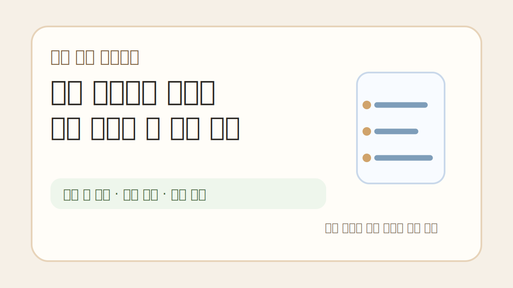
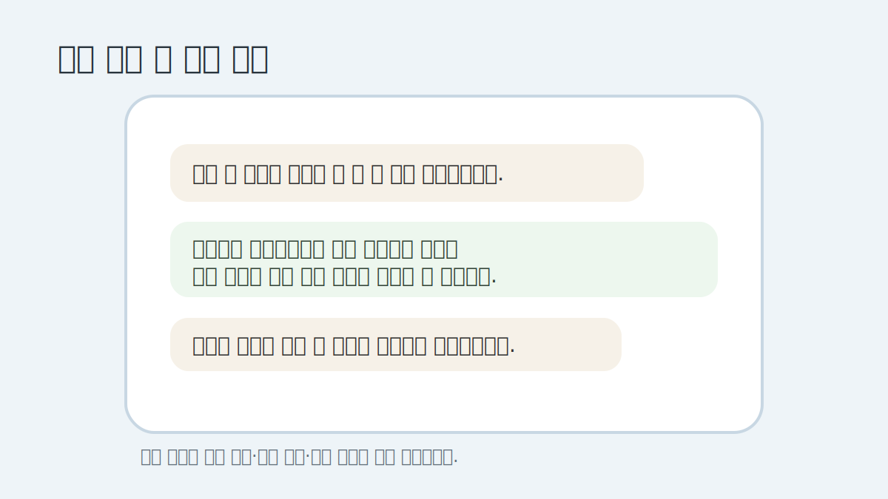
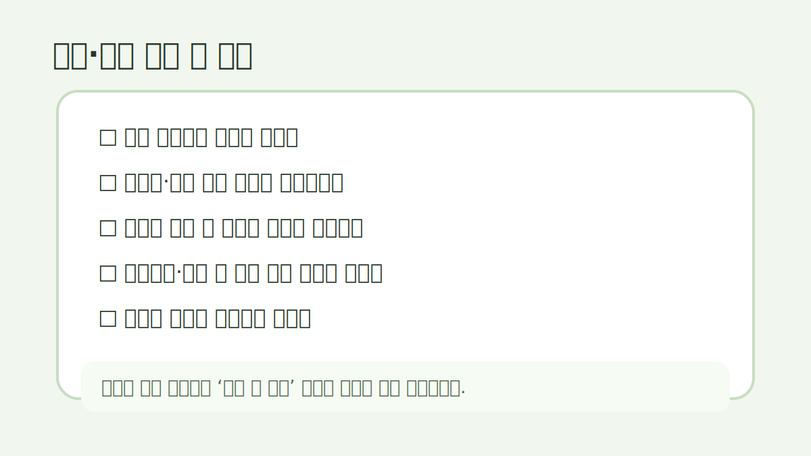

# 펜션 예약취소 안내문, 세게 말하기 전에 기준부터 정리해두면 덜 싸웁니다

펜션이나 작은 숙소를 운영하면 예약 취소 연락이 제일 조심스럽습니다.
손님 입장에서는 갑자기 일정이 바뀐 거고, 운영자 입장에서는 이미 방 하나가 묶여 있던 시간입니다.

문제는 이때 말투가 조금만 세도 바로 감정싸움처럼 보인다는 점입니다.
그래서 “환불 불가입니다”부터 말하기보다, 예약 전에 어떤 기준으로 안내했는지가 더 중요합니다.

이 글은 법률 자문이 아닙니다.
숙박업 운영자가 예약 전후 안내문을 정리할 때 참고할 수 있는 실무 메모에 가깝습니다.
정확한 분쟁 기준은 공정거래위원회/소비자원 자료, 예약 플랫폼 약관, 개별 예약 조건을 함께 확인해야 합니다.

## 예약 확정 전에 먼저 보여줘야 합니다

취소 규정은 취소가 들어온 뒤에 처음 말하면 거의 늦습니다.
손님은 “예약할 때 못 봤는데요”라고 느낄 수 있고, 운영자는 “이미 공지했는데요”라고 말하게 됩니다.

그래서 예약 확정 전에 짧게라도 남겨두는 편이 안전합니다.
카카오톡, 문자, 예약폼, 입금 안내 중 하나에는 꼭 들어가야 합니다.

예시는 이 정도로 시작할 수 있습니다.

> 예약 확정 전 안내드립니다.  
> 입실일이 가까워질수록 객실 재판매가 어려워 취소 시점에 따라 환불 금액이 달라질 수 있습니다.  
> 예약 전 날짜와 인원을 한 번 더 확인 부탁드립니다.

딱딱하게 보일 수 있지만, 나중에 서로 기억이 다른 것보다 낫습니다.

## “환불 불가”보다 “취소 시점”을 먼저 말합니다

작은 숙소일수록 당일 취소 한 건이 크게 느껴집니다.
그렇다고 모든 상황을 무조건 환불 불가로 쓰면 분쟁 위험이 커질 수 있습니다.

문구는 이렇게 바꾸는 편이 낫습니다.

> 취소 시점에 따라 환불 기준이 달라질 수 있습니다.  
> 입실일에 가까운 취소는 객실 재판매가 어려워 일부 금액이 공제될 수 있습니다.  
> 자세한 기준은 예약 전 안내드린 취소 규정과 예약 채널 기준을 함께 확인해 안내드립니다.

말은 길어졌지만, 손님에게 “왜 그런지”가 보입니다.
이게 은근히 중요합니다.

## 성수기와 비수기는 따로 적어두는 게 좋습니다

숙박업은 날짜에 따라 가치가 크게 달라집니다.
평일 비수기와 여름 휴가철 토요일은 취소가 주는 손실이 다릅니다.

그래서 하나의 문장으로 다 처리하기보다, 최소한 이렇게 나눠두는 편이 좋습니다.

- 일반 기간
- 성수기/연휴 기간
- 입실 임박 예약
- 단체/연박 예약
- 기상 악화나 천재지변처럼 별도 확인이 필요한 경우

여기서 중요한 건 “업장 마음대로 세게 쓰기”가 아닙니다.
소비자분쟁해결기준, 예약 플랫폼 약관, 실제 고지 여부를 같이 봐야 합니다.

## 취소 연락을 받았을 때 답장 순서

취소 연락이 오면 바로 금액부터 말하고 싶어집니다.
하지만 답장 순서를 조금 바꾸면 덜 날카롭게 보입니다.

저는 이런 흐름이 낫다고 봅니다.

1. 취소 요청 확인
2. 예약 정보 확인
3. 사전 안내된 기준 언급
4. 환불 가능 금액 또는 확인 필요 사항 안내
5. 처리 예상 시간 안내

예시는 이렇습니다.

> 취소 요청 확인했습니다.  
> 예약일은 7월 20일, 객실은 A동 201호로 확인됩니다.  
> 예약 확정 시 안내드린 취소 기준에 따라 환불 가능 금액을 확인해드리겠습니다.  
> 결제수단에 따라 실제 입금까지는 며칠 정도 걸릴 수 있습니다.

이 정도만 해도 “안 됩니다” 느낌이 줄어듭니다.

## 손님에게 불리한 문구는 다시 확인합니다

가끔 안내문에 이런 문장을 넣고 싶을 때가 있습니다.

> 어떤 사유로도 환불 불가합니다.

운영자 입장에서는 확실해 보여도, 실제 분쟁에서는 문제가 될 수 있습니다.
특히 예약 전에 충분히 고지하지 않았거나, 플랫폼 약관과 다르거나, 소비자에게 지나치게 불리하면 더 조심해야 합니다.

그래서 문구는 강하게 닫기보다 확인 여지를 남기는 편이 안전합니다.

> 취소 및 환불은 예약 시 안내된 기준, 이용 채널의 약관, 관련 소비자분쟁 기준을 함께 확인해 처리됩니다.

완벽한 문장은 아니지만, 적어도 “무조건 안 됨”처럼 보이진 않습니다.

## 예약 전 체크리스트

취소 안내문을 쓰기 전에 아래를 먼저 확인해두면 좋습니다.

- 예약 채널마다 취소 기준이 같은가
- 성수기/비수기 기준 날짜가 정리돼 있는가
- 입실 며칠 전부터 수수료가 달라지는가
- 예약금만 받은 경우와 전액 결제한 경우가 다른가
- 취소 안내를 손님이 볼 수 있는 위치에 남겼는가
- 카톡/문자/예약폼에 기록이 남는가
- 천재지변, 항공/교통 문제, 질병 등 예외 상황은 어떻게 확인할 것인가

생각보다 기본적인 것에서 분쟁이 납니다.
“공지했어요”가 아니라 “어디에, 언제, 어떤 문장으로 보여줬는지”가 남아야 합니다.

## 너무 세게 쓰지 않아도 기준은 세울 수 있습니다

예약 취소 안내문은 손님을 겁주는 문구가 아닙니다.
운영자와 손님이 같은 기준을 보고 예약하자는 약속에 가깝습니다.

그래서 핵심은 세 가지입니다.

- 예약 전에 먼저 보여주기
- 취소 시점별로 말하기
- 예외 상황은 단정하지 않고 확인하기

숙소마다 예약 채널, 객실 수, 성수기 기준이 달라서 그대로 복붙하기보다는 말투와 기준을 맞춰 바꾸는 게 좋습니다.

반응이 있으면 예약 확정, 취소 접수, 환불 안내, 날씨 변수, 노쇼 대응 문구를 상황별로 따로 정리해보겠습니다.
