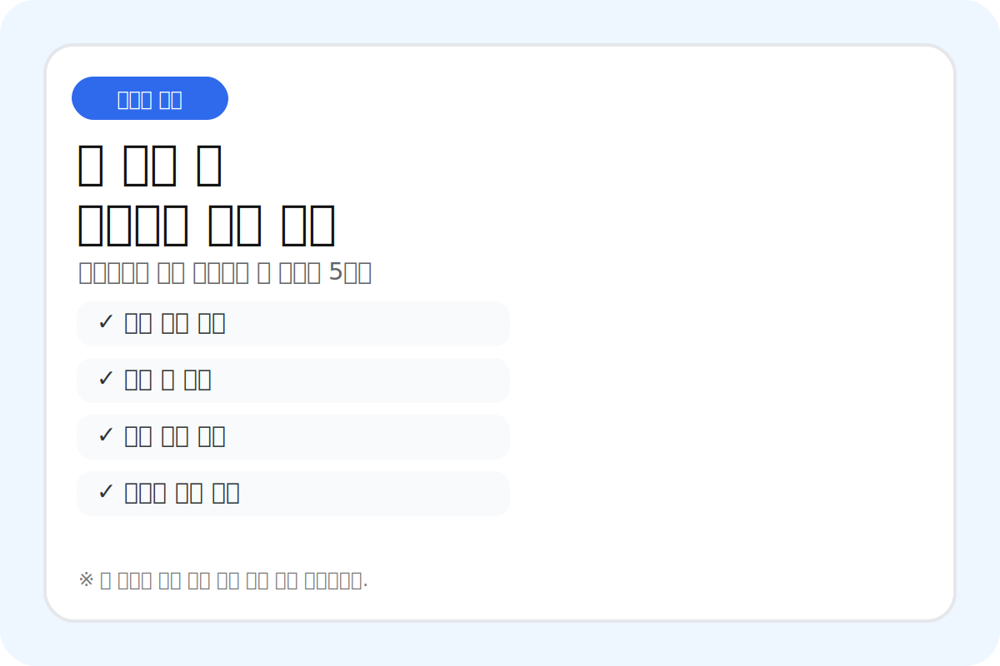
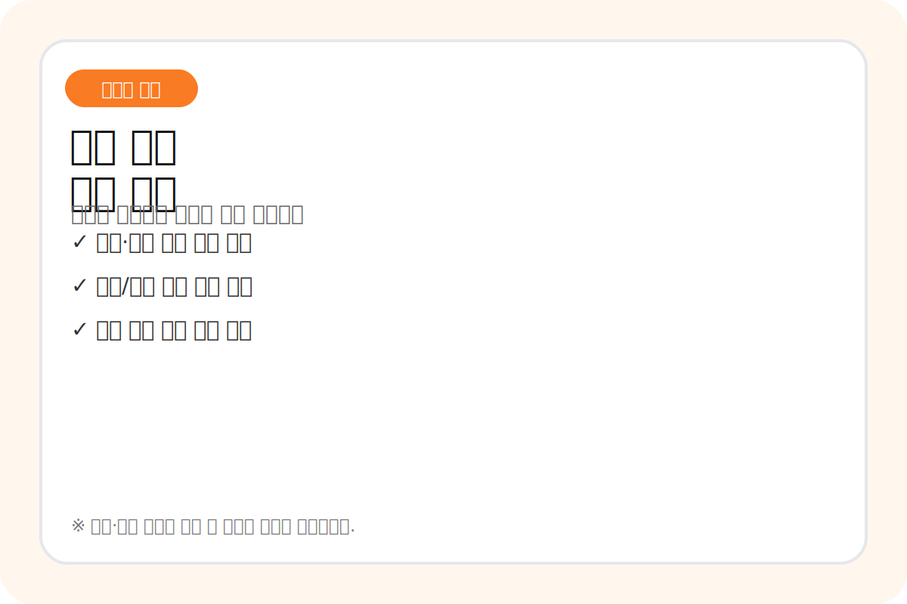
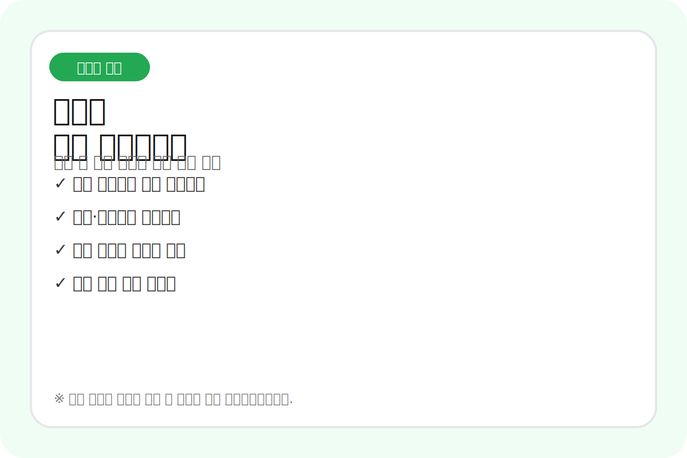

# 비 오는 날 애견미용 예약, 보호자에게 미리 알려두면 덜 꼬입니다

장마철에는 예약표가 평소보다 쉽게 흔들립니다.

강아지가 젖은 채로 들어오기도 하고, 보호자님이 주차 때문에 늦기도 하고, 산책을 못 해서 아이가 평소보다 예민해 보이는 날도 있습니다.

샵에서 다 감당하면 되지 않나 싶지만, 막상 같은 설명을 오전부터 계속 하다 보면 꽤 지칩니다.

그래서 비가 많이 오는 시기에는 예약 전 안내문을 짧게라도 보내두는 편이 낫습니다.
보호자님을 통제하려는 문구가 아니라, 서로 덜 당황하려고 맞춰두는 안내에 가깝습니다.

## “늦지 마세요”보다 덜 불편한 문구가 필요합니다

비 오는 날 제일 많이 생기는 일이 도착 지연입니다.

그런데 그대로 “늦으면 안 됩니다”라고 보내면 받는 사람도 조금 딱딱하게 느낍니다.
샵 입장에서는 다음 예약이 밀리니 꼭 필요한 안내인데 말이지요.

이럴 때는 이유를 같이 적는 게 낫습니다.

> 비가 오는 날은 주차와 이동 시간이 평소보다 길어질 수 있어요.  
> 다음 아이 예약 준비 때문에 예약 시간보다 5~10분 여유 있게 도착 부탁드립니다.

조금 더 부드럽게 쓰면 이렇게도 됩니다.

> 우천 시에는 아이가 젖은 상태로 도착하는 경우가 있어 드라이 시간이 추가될 수 있습니다.  
> 예약 시간에 맞춰 진행할 수 있도록 출발 전 여유를 조금만 잡아주세요.

말은 길지 않아도 됩니다.
핵심은 “왜 시간이 중요한지”를 같이 알려주는 겁니다.

## 젖은 털은 미용 시간이 달라질 수 있습니다

보호자님 입장에서는 비 맞은 게 별일 아닐 수 있습니다.
하지만 미용하는 쪽에서는 털 상태가 꽤 중요합니다.

젖은 털, 엉킨 털, 산책 후 흙이 묻은 발은 미용 전 준비 시간이 조금씩 늘어날 수 있습니다.
이걸 미리 말하지 않으면 현장에서 설명이 길어집니다.

> 비 오는 날에는 아이 털이 젖거나 엉켜 있을 수 있어 미용 전 건조·정리 시간이 조금 더 필요할 수 있습니다.  
> 상태에 따라 마무리 시간이 평소보다 늦어질 수 있는 점 양해 부탁드립니다.

여기서 조심할 건 추가 비용을 단정해서 쓰지 않는 겁니다.
샵마다 기준이 다르니, 추가 시간이나 비용 안내가 필요하다면 예약 시 미리 고지한 샵 기준에 맞춰 부드럽게 적는 편이 안전합니다.

## 예약 변경 요청에는 기준을 짧게 남겨둡니다

비가 많이 오면 “오늘 말고 내일 가능할까요?”라는 메시지가 늘어납니다.
가능하면 바꿔드리면 좋지만, 당일 변경이 계속되면 예약표가 무너집니다.

답장은 친절하되 기준은 있어야 합니다.

> 오늘 우천으로 이동이 어려우시면 가능한 시간대로 변경 도와드릴게요.  
> 다만 당일 변경은 빈 시간이 있을 때만 가능해서, 원하시는 시간대가 바로 어렵다면 가장 가까운 가능 일정을 안내드리겠습니다.

예약금이 있는 샵이라면 더 조심해서 써야 합니다. 환불·차감 여부를 여기서 단정하기보다, 예약 시 안내한 기준을 다시 확인하는 말투가 낫습니다.

> 예약금/당일 변경 기준은 예약 시 안내드린 내용을 기준으로 다시 확인해드리겠습니다.  
> 변경 가능 시간 먼저 확인해드릴게요.

이 정도만 적어도 싸우자는 느낌이 덜합니다.
“규정입니다”만 보내는 것보다 훨씬 낫습니다.

## 보호자에게 미리 보내기 좋은 체크리스트

비 오는 날 예약 전에는 긴 공지보다 체크리스트가 잘 먹힙니다.
보호자님도 읽기 쉽고, 샵에서도 같은 말을 덜 하게 됩니다.

- 예약 시간보다 5~10분 여유 있게 도착하기
- 아이가 많이 젖었으면 도착 시 먼저 말해주기
- 산책 후 발이 많이 젖거나 더러우면 수건으로 한 번 닦아오기
- 우비나 이동가방을 사용했다면 맡기기 전 벗겨두기
- 당일 변경이 필요하면 가능한 한 빨리 연락하기
- 예약금/변경 기준은 샵 안내문 다시 확인하기
- 미용 후 바로 긴 야외 이동이 예정돼 있다면 보호자님 일정에 맞춰 한 번 더 확인하기

전부 지켜달라는 뜻으로 쓰면 부담스럽습니다.
“이 중 몇 가지만 확인해도 진행이 훨씬 편합니다” 정도로 풀어주는 게 좋습니다.

## 샵 공지는 딱딱해도 안 되고, 너무 물러도 안 됩니다

장마철 안내문은 친절해야 하지만 기준도 있어야 합니다.

보호자님 사정을 다 이해하다 보면 샵 일정이 무너지고, 반대로 규정만 앞세우면 불필요한 감정이 생깁니다.

그래서 문구는 짧게.
이유는 한 줄만.
기준은 샵 규정에 맞게.

이 세 가지만 맞추면 비 오는 날 메시지가 조금 덜 꼬입니다.

샵마다 예약금, 지각, 매트 정리, 추가 건조 기준이 다르니 위 문구는 그대로 쓰기보다 예약 시 고지한 본인 샵 기준과 말투에 맞게 바꿔 쓰는 게 좋습니다. 이 글은 의료·법률 판단이 아니라 장마철 예약 응대 문구 정리용입니다.
반응이 있으면 펫샵 상황별 안내 문구도 따로 정리해볼게요.
