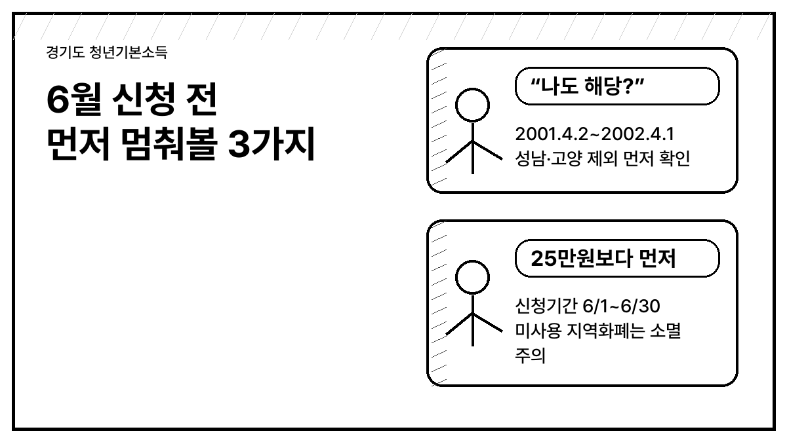
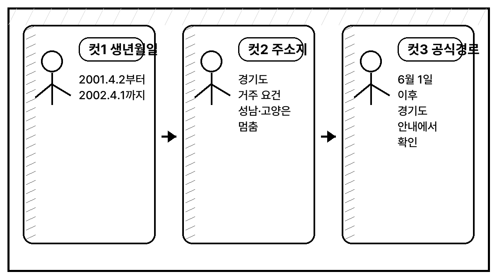
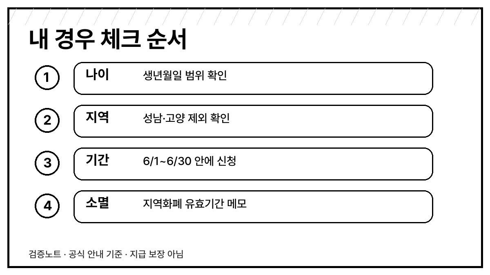

# 경기도 청년기본소득 2분기, 성남·고양이면 먼저 멈춰보세요

경기도 청년기본소득 2분기 신청이 **2026년 6월 1일부터 6월 30일까지**로 안내돼 있습니다.

그런데 이번 글은 “신청하세요”보다 먼저 볼 부분이 있습니다. **성남시·고양시 주소라면 2026년에는 지급 불가**로 적혀 있기 때문입니다.

## 5초 판정

- 생년월일이 **2001.4.2 ~ 2002.4.1** 안에 들어가나요?
- 신청일 기준 경기도에 살고 있나요?
- 경기도 거주가 **3년 이상 계속** 또는 **합산 10년 이상**인가요?
- 주소가 **성남시·고양시가 아닌가요?**

여기서 하나라도 걸리면 바로 신청 화면부터 열기보다, 공식 안내에서 조건을 먼저 보는 편이 낫습니다.

## 왜 성남·고양을 먼저 보라고 하나요

공식 경기도 안내에는 성남시는 조례 폐지, 고양시는 시비 미편성으로 2026년 청년기본소득 사업을 중단했다고 적혀 있습니다.

말하자면 “경기도 청년이면 전부”가 아닙니다. 주소지가 성남·고양이면 이번 2분기 글을 보고 기대했다가 헛걸음할 수 있습니다.

## 금액은 얼마인가요

안내 기준은 **분기별 25만원**입니다. 최대 100만원이라는 말은 1년 네 분기를 모두 받을 수 있을 때의 표현입니다.

2분기만 놓고 보면 핵심은 이렇습니다.

| 확인할 것 | 공식 안내 기준 |
|---|---|
| 신청기간 | 2026.06.01 ~ 06.30 |
| 지급대상 생년월일 | 2001.04.02 ~ 2002.04.01 |
| 지급개시 | 2026.07.20 예정 |
| 지급형식 | 시·군 지역화폐 |
| 주의 | 유효기간 내 미사용 시 소멸 |

## 신청 전에 헷갈리는 부분

기초생활수급자는 수급자증명서를 내면 일시금 지급 안내가 따로 있습니다. 이 부분은 본인 상황에 따라 증빙이 달라질 수 있으니 신청 화면에서 다시 확인해야 합니다.

또 지역화폐는 초본상 주소지 시·군 안에서 쓰는 것이 기본입니다. 다만 학원수강료와 시험응시료는 경기도 전역 및 온라인몰 사용 안내가 같이 적혀 있습니다.

## 지금 할 일

1. 생년월일 범위부터 본다.
2. 성남·고양 제외 여부를 먼저 확인한다.
3. 6월 1일 이후 신청 화면이 열리면 공식 경로에서만 신청한다.
4. 선정 뒤에는 지역화폐 유효기간을 따로 메모한다.

저라면 신청 페이지부터 누르기보다, 위 네 가지를 메모장에 먼저 적어두겠습니다. 특히 **성남·고양 제외**와 **미사용 소멸**은 그냥 지나치기 쉽습니다.

## 공식자료

- [경기도청 · 청년기본소득 공식 안내](https://www.gg.go.kr/contents/contents.do?ciIdx=1037&menuId=2736)
- 잡아바 신청 페이지는 발행 전 점검 시점에 직접 URL이 404로 응답했습니다. 6월 1일 이후 경기도 공식 안내에서 연결되는 신청 경로를 다시 확인하는 방식이 안전합니다.

※ 이 글은 신청 대행이나 지급 보장을 하지 않습니다. 2026년 5월 28일 공식 안내 확인 기준으로 정리했습니다.
