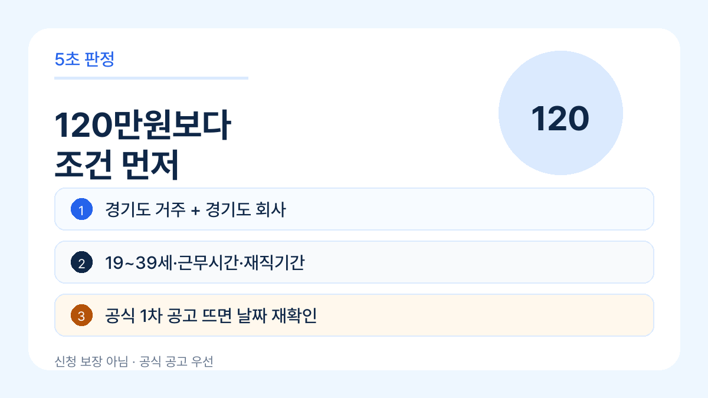
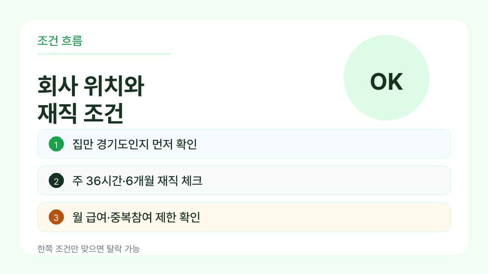
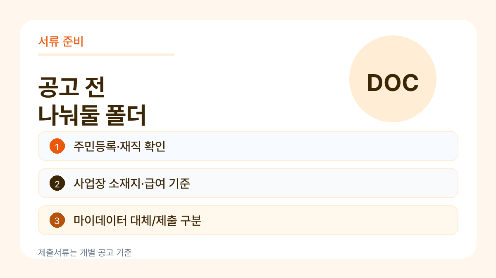

# 경기도 청년 복지포인트, 7월 접수 전 먼저 볼 조건

경기도 청년 복지포인트는 제목만 보면 “120만원 받을 수 있나?”가 먼저 보입니다.

그런데 실제로는 금액보다 **회사 위치, 재직기간, 주 근무시간, 월 급여 기준**에서 먼저 갈립니다. 여기서 하나라도 안 맞으면 서류를 다 챙겨도 헛걸음이 될 수 있습니다.

> 이 글은 2026년 경기도 청년 노동자 지원사업 선발계획과 전년도 1차 모집 공지를 기준으로 정리한 사전 체크 글입니다. 공식 메인 일정상 2026년 1차는 모집공고 6월 24일, 신청 접수 7월 1일~7월 13일로 안내되어 있습니다. 다만 개별 모집공고/FAQ가 올라오면 날짜와 제출서류는 그 공고를 우선으로 봐야 합니다.

## 5초 판정부터 해보면

아래 네 가지가 먼저입니다.

1. 나는 19~39세 범위에 들어가는가?
2. 주민등록상 경기도 거주자인가?
3. 회사나 사업장이 경기도에 있는가?
4. 주 36시간 이상, 6개월 이상 재직 조건을 볼 수 있는가?

여기까지 맞아야 그다음에 월 급여, 사업장 유형, 중복 참여 제한을 봅니다.

말하자면 “청년이면 신청”이 아니라 **경기도에서 일하는 청년 노동자 지원사업**에 가깝습니다.

## 많이 빠지는 조건은 회사 쪽입니다

헷갈리는 지점은 본인 나이보다 회사 쪽입니다.

경기도 밖 회사에 다니는데 집만 경기도인 경우, 반대로 회사는 경기도인데 거주지가 다른 경우처럼 한쪽만 맞는 상황이 생깁니다.

선발계획에는 공통 조건으로 **경기도 거주, 경기도 소재 기업 재직, 월 급여 기준, 주 36시간 이상, 6개월 이상 재직**이 함께 나옵니다. 그래서 신청 전에는 회사 주소와 재직 기준부터 보는 게 안전합니다.

또 비영리법인은 모두 되는 식으로 보면 안 됩니다. 국가, 지방자치단체, 공공기관 등 제외대상이 붙을 수 있어 개별 공고문 확인이 필요합니다.

## 120만원보다 먼저 볼 숫자

금액은 연 120만원으로 알려져 있지만, 실제 신청 판단에서는 아래 숫자가 더 먼저입니다.

- 출생연도 범위
- 월 급여 기준
- 주 근무시간
- 재직기간
- 모집 차수별 접수기간

특히 6개월 재직이나 월 급여 기준은 “대충 비슷한데?”로 넘기기 어렵습니다. 회사 서류와 4대보험/고용 관련 자료에서 확인되는 숫자라서, 신청 전에 캡처나 발급 순서를 정해두는 편이 낫습니다.

## 서류는 이렇게 나눠두면 덜 헷갈립니다

신청 공고가 뜨면 바로 확인할 폴더를 미리 나눠두세요.

- 주민등록 관련 확인 자료
- 재직 확인 자료
- 사업장 소재지 확인 자료
- 급여 또는 건강보험료 관련 확인 자료
- 공공 마이데이터 동의로 대체되는 서류
- 중복 참여 제한 확인용 메모

공공 마이데이터 동의로 줄어드는 서류가 있을 수 있지만, 모든 자료가 자동으로 해결된다고 보면 안 됩니다. 공고문에서 “제출 필요”와 “동의 시 생략 가능”을 나눠 보는 게 핵심입니다.

## 공식 공고에서 봐야 할 문장

공식 공고가 올라오면 제목보다 아래 문장을 먼저 찾으세요.

- 모집대상
- 신청기간
- 지원내용
- 제외대상
- 중복참여 제한
- 제출서류
- 선정기준

블로그 글에서 날짜만 보고 움직이면 위험합니다. 같은 사업도 차수별로 기간, 인원, 서류 안내가 달라질 수 있습니다.

## 지금 기준 정리

지금 할 일은 신청 버튼을 찾는 것보다 조건을 먼저 걸러보는 겁니다.

경기도 거주, 경기도 소재 기업 재직, 19~39세, 주 36시간 이상, 6개월 이상 재직, 월 급여 기준. 이 여섯 가지를 먼저 확인하면 공고가 열렸을 때 훨씬 덜 헤맵니다.

공식 개별 모집공고가 열리면 날짜와 서류는 그 공고 기준으로 다시 확인하세요. 이 글은 신청 대행이나 선정 보장이 아니라, 신청 전에 빠지기 쉬운 조건을 줄이는 용도입니다.

## 공식 확인

- 경기도청 고시·공고: 2026년 청년 노동자 지원사업 선발계획 공고 확인
- 경기도뉴스포털: 전년도 청년 복지포인트 1차 모집 보도자료
- 청년 노동자 지원사업 접수 사이트: 접수 공고와 FAQ 확인
